# Jarvis Pessoal

Assistente de inteligência artificial para desktop, **local-first** e em português do Brasil. O Jarvis roda como aplicativo Windows com uma interface HUD desenvolvida em PySide6/QML, conecta-se a provedores de IA locais ou em nuvem e reúne voz, memória de longo prazo, automações e um agente com ferramentas reais.

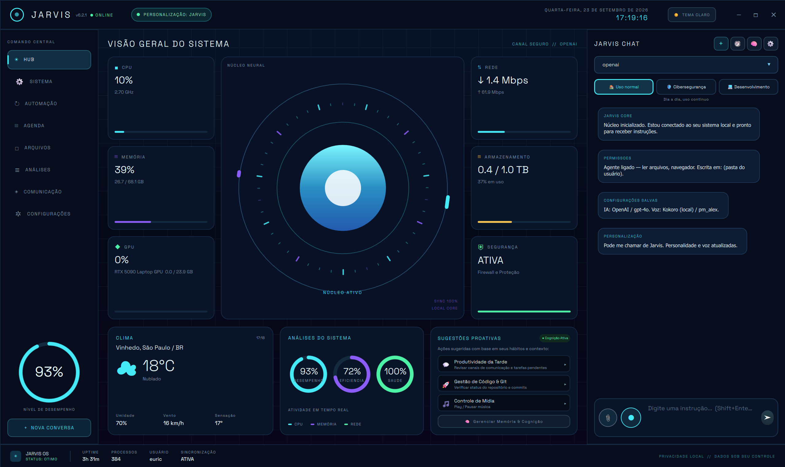

## Sumário

- [Visão geral](#visão-geral)
- [Recursos do sistema](#recursos-do-sistema)
- [Personalização por perfil e setor](#personalização-por-perfil-e-setor)
- [Setor Saúde](#setor-saúde)
- [Memória e aprendizado](#memória-e-aprendizado)
- [Voz](#voz)
- [Segurança e privacidade](#segurança-e-privacidade)
- [Ferramentas do agente](#ferramentas-do-agente)
- [Stack e arquitetura](#stack-e-arquitetura)
- [Instalação](#instalação)
- [Testes](#testes)
- [Limitações conhecidas](#limitações-conhecidas)

## Visão geral

O Jarvis Pessoal é um assistente de IA de desktop 100% local-first. Ele possui interface gráfica futurista, conversa com múltiplos provedores de IA, executa ferramentas autorizadas, reconhece e sintetiza voz, aprende preferências ao longo do uso e adapta sua atuação ao ramo de atividade escolhido.

Os dados do usuário ficam no próprio computador, em um banco SQLite local (`data/jarvis.db`). Não há conta obrigatória, telemetria ou servidor próprio. O tráfego de rede ocorre apenas para os serviços habilitados pelo usuário, e o funcionamento pode ser totalmente local com LM Studio ou Ollama.

### Números do projeto

| Item | Quantidade |
| --- | ---: |
| Módulos Python em `src/jarvis/` | 39 |
| Arquivos de ferramentas em `src/jarvis/tools/` | 20 |
| Ferramentas ativas do agente | 46 |
| Linhas aproximadas de `gui.py` | 4.480 |
| Linhas aproximadas de `Main.qml` | 12.380 |
| Arquivos de teste | 40 |
| Testes automatizados | 328 |
| Tabelas no banco local | 22 |

O HUB apresenta telemetria do computador, clima, estado de segurança, atividade do núcleo neural, sugestões proativas e as permissões atuais.

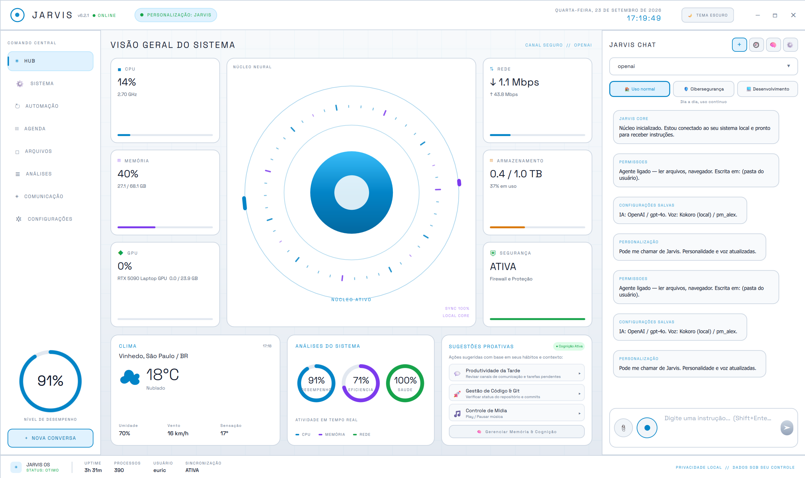

## Recursos do sistema

### Telas principais

O menu lateral adapta-se ao setor de atividade ativo:

`HUB · SISTEMA · AUTOMAÇÃO · AGENDA · ARQUIVOS · ANÁLISES · COMUNICAÇÃO · CONFIGURAÇÕES`

No setor Saúde, as telas Sistema, Análises e Arquivos são substituídas por Pacientes e Exames & Docs; Agenda e Comunicação recebem foco clínico.

#### HUB

- Telemetria de CPU, GPU, memória, rede e disco.
- Clima local por Open-Meteo, sem chave de API.
- Indicador de atividade do núcleo neural.
- Estado do firewall e da segurança.
- Sugestões proativas por horário e setor.
- Resumo de personalização e permissões.

#### Sistema

- Especificações de hardware e software.
- Gerenciador de processos.
- Informações de discos, limpeza e energia.
- Ações rápidas do Windows.

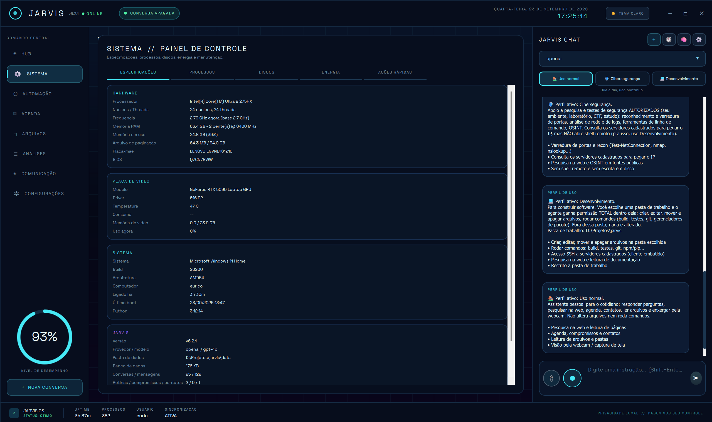

#### Automação

Permite criar rotinas como sequências de passos em linguagem natural, executá-las por comando de voz e agendá-las uma única vez ou com frequência diária ou semanal.

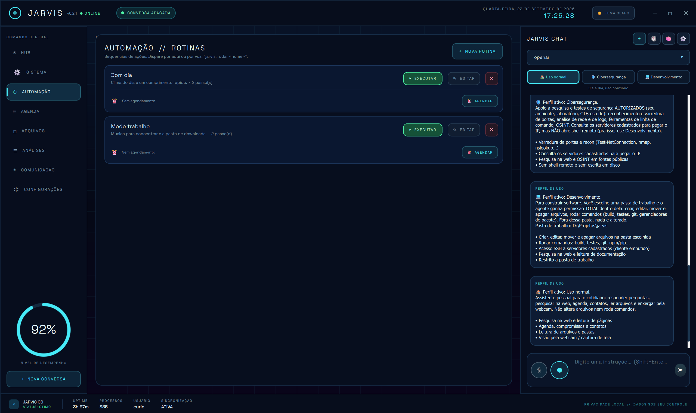

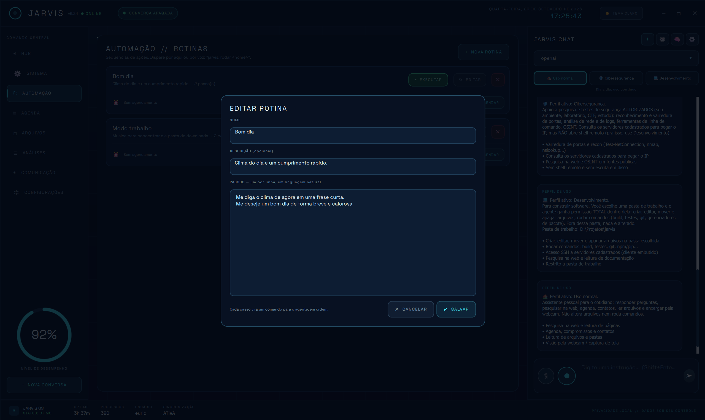

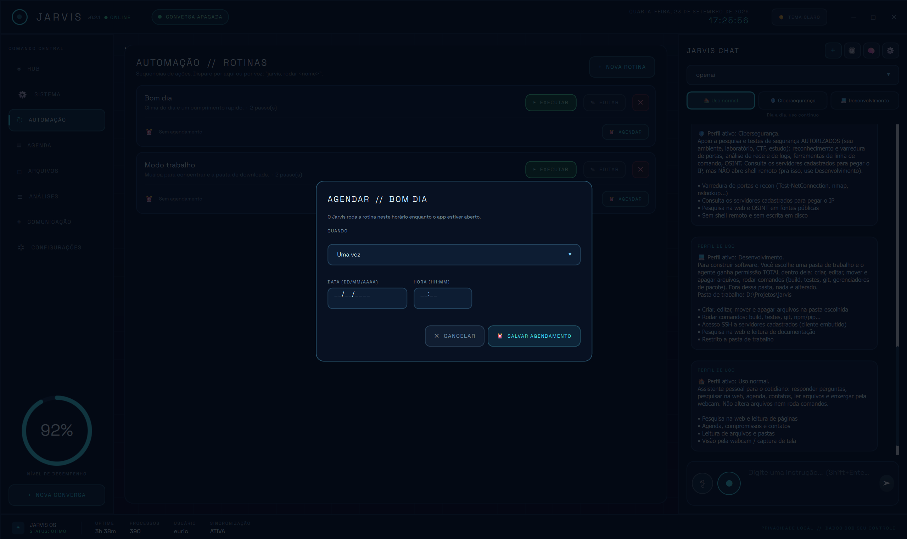

#### Agenda

- Compromissos e contatos.
- Lembretes por voz.
- Datas e aniversários.

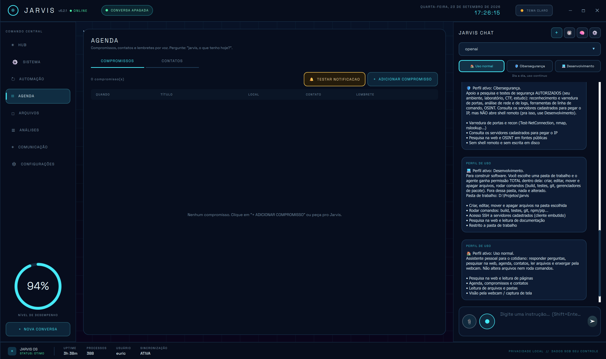

#### Arquivos

- Exploração de arquivos em modo somente leitura.
- Busca por nome ou conteúdo.
- Pré-visualização e favoritos.
- Ação “peça para o Jarvis” sobre o arquivo aberto.

#### Análises

Caixa de ferramentas para PDF, Word, imagens, planilhas e operações assistidas por IA:

- PDF para Word e Word para PDF.
- Junção, divisão e extração de páginas de PDF.
- Conversão, redimensionamento, compressão e remoção de metadados de imagens.
- Extração de texto, formatação de JSON, hash de arquivos e outras utilidades.
- Resumo e tradução com IA.

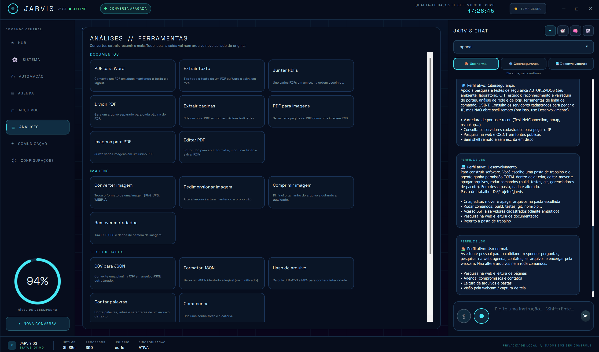

#### Comunicação

- Canais de atendimento.
- Integração com WhatsApp por QR Code.
- Agentes de IA configuráveis por canal, com nome, provedor, modelo e prompt próprios.

#### Configurações

A janela de configurações possui cinco áreas:

| Área | Função |
| --- | --- |
| Geral | Provedor e modelo de IA, voz, transcrição, clima e aparência |
| Permissões | Capacidades do agente, pastas permitidas e servidores SSH |
| Comunicação | Chaves dos provedores de IA e voz |
| Identidade | Nome, personalidade, tonalidade, sotaque e servidores MCP |
| Setor | Seleção entre 12 ramos de atividade e suas capacidades |

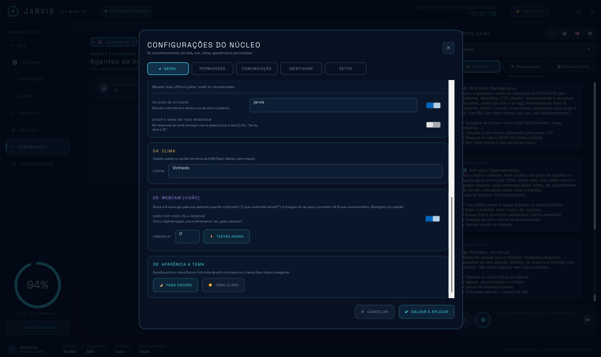

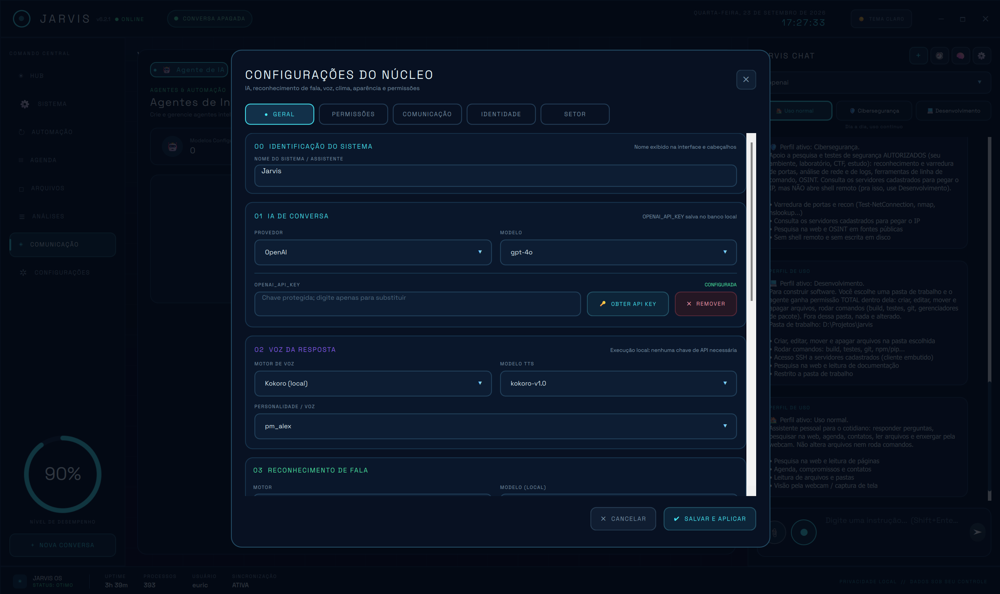

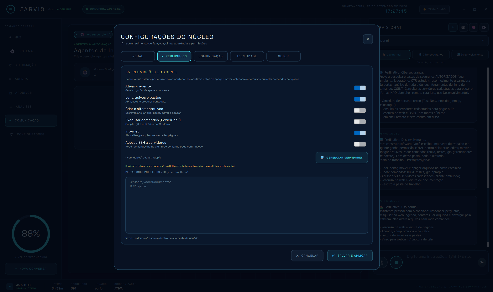

### Painéis rápidos no chat

- **Ferramentas de Segurança:** 17 ações no perfil Cibersegurança.
- **Assistente de Código:** 9 ações no perfil Desenvolvimento.
- **Apoio Clínico:** 10 ações no setor Saúde.

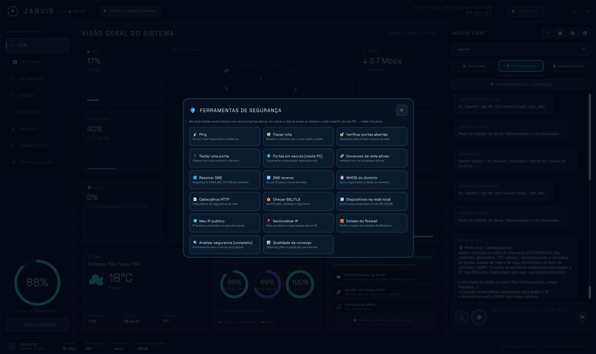

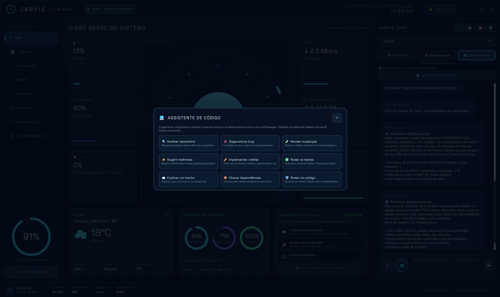

### Outros recursos de interface

- Histórico de conversas com reabertura e pesquisa.
- Gerenciamento das memórias aprendidas pela IA.
- Anexos no chat.
- Blocos de código com ações de copiar, baixar e visualizar.
- Seleção e cópia de texto.
- Confirmação antes de ações destrutivas.

## Personalização por perfil e setor

O Jarvis utiliza duas camadas independentes que podem ser combinadas livremente.

### Perfil de uso: o que o agente pode fazer

- **Uso normal:** leitura, web e agenda, sem alterar arquivos ou executar comandos.
- **Cibersegurança:** shell e análise de rede, sem SSH remoto.
- **Desenvolvimento:** permissão total dentro de uma pasta escolhida, incluindo ferramentas de desenvolvimento e SSH.

### Setor de atividade: em qual domínio o assistente atua

Setores disponíveis:

`Geral · Saúde · Jurídico · Marketing · Financeiro · Varejo · Educação · Agronegócio · Imobiliário · Contabilidade · Consultoria · Programação`

Cada setor pode:

- alterar a persona e o contexto de domínio;
- esconder ou renomear itens de menu;
- adicionar telas específicas;
- adaptar as sugestões proativas do HUB.

As camadas são ortogonais. Por exemplo, é possível combinar o setor Programação com o perfil Desenvolvimento.

## Setor Saúde

O setor Saúde funciona como uma ferramenta de **segundo olhar clínico**, mantendo os dados localmente e estruturando informações para revisão profissional.

### Pacientes

- Grade de pacientes com pesquisa por nome, documento ou telefone.
- Cadastro com histórico pessoal, familiar e social.
- Alergias, comorbidades, medicações e convênio.
- Contato de emergência.

### Exames & Docs

- Registros de laudo, exame, consulta, evolução, prescrição e nota.
- Classificação visual por nível de risco analisado.
- Sinais vitais estruturados.
- Anexos PDF, imagem, Word e Excel, com extração automática de texto quando aplicável.
- Ação de análise para um segundo olhar sobre o caso.

### Apoio à decisão clínica

A análise pode considerar idade, sexo, alergias, comorbidades, medicações, antecedentes, prontuário anterior, registro atual e texto extraído dos anexos. O resultado é estruturado em:

- nível de risco: crítico, alto, moderado ou baixo;
- alertas críticos e resumo;
- achados relevantes;
- CID-10 sugeridos, com justificativa e confiança;
- diagnósticos diferenciais;
- possíveis interações medicamentosas;
- opções de conduta e exames;
- informações que ainda precisam ser perguntadas ou examinadas.

### Base de conhecimento clínica local

- Aproximadamente 50 interações medicamentosas curadas, com gravidade, mecanismo, sinônimos e classes.
- Base CID-10 do DATASUS com 10.236 códigos, pesquisável por código ou descrição.
- Calculadoras de IMC, clearance de creatinina por Cockcroft-Gault, superfície corporal e dose pediátrica.

### Guardrails clínicos

- Todo resultado é um **rascunho para revisão profissional**, nunca diagnóstico ou prescrição final.
- O sistema não se comunica diretamente com o paciente.
- Sinais de emergência direcionam para avaliação presencial.
- Dados do paciente são tratados como confidenciais, em linha com a LGPD.
- O sistema é instruído a não inventar valores, doses ou referências.

## Memória e aprendizado

As memórias são permanentes e locais, distribuídas entre as tabelas `user_memories`, `user_behavior_profile` e `user_behavior_logs`.

### Camada rápida

Regras locais reconhecem frases como “meu nome é”, “prefiro”, “nunca use” ou “estou desenvolvendo” no mesmo turno, sem custo adicional de IA.

### Camada profunda

A cada três turnos, uma tarefa opcional em segundo plano consulta o provedor configurado para extrair fatos duráveis sobre o usuário e seus projetos. O processo inclui deduplicação e não bloqueia a resposta principal.

As memórias são priorizadas por relevância para cada pergunta. O perfil comportamental também aprende horários de uso, linguagem de programação preferida e preferência por respostas curtas ou detalhadas.

O usuário pode consultar, editar e apagar o conteúdo no painel **Memória Contextual & Aprendizado**.

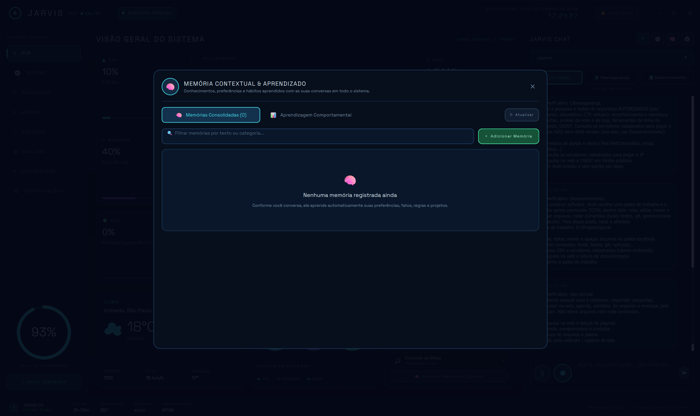

## Voz

- Palavra de ativação contínua “Jarvis”, com VAD e Whisper leve.
- Reconhecimento local com faster-whisper ou em nuvem com OpenAI.
- Síntese pelo SAPI5 do Windows, pyttsx3, Kokoro local ou Gemini TTS.
- Nome, personalidade, tonalidade e sotaque configuráveis.

## Segurança e privacidade

- Dados armazenados localmente em SQLite, sem telemetria própria.
- Chaves de API e senhas SSH podem ser armazenadas cifradas no banco local pela interface.
- Variáveis de ambiente também podem ser usadas na configuração manual dos provedores.
- Ações potencialmente irreversíveis exigem confirmação explícita.
- Operações de rede usam Python e ferramentas nativas do Windows.
- O cliente SSH procura o OpenSSH instalado no sistema; executáveis compilados não são distribuídos neste repositório.
- Ferramentas vindas de servidores MCP externos sempre exigem confirmação antes da execução.

## Ferramentas do agente

O diretório `src/jarvis/tools/` reúne 46 ferramentas ativas, além de ferramentas MCP carregadas dinamicamente.

### Sempre disponíveis

- `calculadora`
- `consultar_agenda`, `salvar_compromisso`
- `buscar_contato`, `salvar_contato`
- `consultar_historico_conversas`, `consultar_memoria_longo_prazo`
- `abrir_aplicativo`, `gerenciar_janelas`
- `controle_configuracoes_sistema`, `controle_reproducao`, `ajustar_volume`
- `tocar_musica_ou_video`
- `interacoes_medicamentosas`, `buscar_cid`, `calculadora_clinica`
- `organizar_pasta`, `pesquisar_arquivos_inteligente`
- `compactar_descompactar`, `renomear_arquivos_lote`
- `ler_e_analisar_tela`, `interpretador_codigo`
- `analisar_repositorio`, `diagnosticar_bug`, `editar_codigo_local`, `executar_testes_locais`

### Liberadas por permissão

| Permissão | Ferramentas |
| --- | --- |
| Leitura de arquivos | `listar_pasta`, `ler_arquivo`, `buscar_arquivos`, `procurar_texto`, `abrir_pasta` |
| Escrita de arquivos | `escrever_arquivo`, `anexar_arquivo`, `criar_pasta`, `mover`, `apagar` |
| Shell local | `executar_comando`, `recon_rede`, `inspecao_local` |
| Navegador/Web | `abrir_site`, `pesquisar_web`, `gerenciar_guias_navegador`, `buscar_na_web`, `ler_pagina_web` |
| SSH | `listar_servidores`, `executar_no_servidor` |

### Model Context Protocol

Servidores MCP cadastrados em Configurações → Identidade entram automaticamente como ferramentas dinâmicas com prefixo `mcp_`. O cliente utiliza stdio e JSON-RPC 2.0, sem dependência externa, e pede confirmação antes de executar ferramentas remotas.

Todas as ferramentas seguem o contrato `Tool.execute() -> ToolResult`. Resultados legados em texto puro são normalizados para preservar o ciclo de execução do agente.

## Stack e arquitetura

### Linguagens e frameworks

| Camada | Tecnologia |
| --- | --- |
| Linguagem | Python 3.11+ |
| Interface | PySide6 / Qt 6.8+ com QML declarativo |
| Integração Python ↔ QML | Properties, Slots e Signals |
| Banco de dados | SQLite, modo WAL, sem ORM |
| Empacotamento | setuptools com `pyproject.toml` |
| Testes | `unittest` da biblioteca padrão |

### Dependências opcionais

| Grupo | Dependências principais |
| --- | --- |
| `gui` | PySide6, keyring, psutil |
| `voice` | faster-whisper, numpy, pyttsx3, sounddevice |
| `agent` | dnspython |
| `kokoro` | kokoro-onnx, espeakng-loader, phonemizer |
| `tools` | pymupdf, pillow, python-docx, pdf2docx, openpyxl |
| `vision` | opencv-python |
| `full` | Todos os grupos anteriores |

O projeto prioriza a biblioteca padrão e ferramentas nativas do Windows. Isso reduz dependências e evita problemas com extensões nativas bloqueadas por políticas de segurança do sistema.

### Provedores de IA e voz

O roteador possui fallback automático entre:

- LM Studio, local e compatível com a API OpenAI;
- Ollama, local e compatível com a API OpenAI;
- OpenAI;
- Anthropic / Claude;
- Google Gemini, incluindo Gemini TTS.

### Arquitetura em camadas

```text
QML (Main.qml)  <── Property / Slot / Signal ──>  JarvisBackend (gui.py)
                                                        │
                                              JarvisAssistant (assistant.py)
                                                /          │          \
                                      ModelRouter      ToolAgent    CognitiveEngine
                                      (router.py)     (agent.py)    (cognition.py)
                                           │               │
                                     Provedores IA    Tools (tools/*.py)
                                                           │
                                                     Database (SQLite)
```

- `gui.py`: classe `QObject` exposta ao QML e responsável pela ponte com o backend.
- `assistant.py`: orquestra perguntas e respostas, injeta persona e memórias e decide entre agente ou chamada direta.
- `agent.py`: ciclo nativo de function calling e confirmação de ações destrutivas.
- `router.py`: abstração e fallback entre provedores.
- `database.py`: SQL puro, schema versionado e retry para erros transitórios do SQLite no Windows.

### Módulos do backend

| Módulo | Responsabilidade |
| --- | --- |
| `agenda.py` | Compromissos, contatos e lembretes |
| `agent.py` | Agente, ferramentas, confirmações e streaming |
| `artifacts.py` | Cartões de código no chat |
| `assistant.py` | Orquestração central |
| `attachments.py` | Extração de texto e normalização de anexos |
| `cli.py` | Interface de linha de comando |
| `codeassist.py` | Ações do Assistente de Código |
| `cognition.py` | Memória, comportamento e sugestões |
| `config.py` | Carregamento e validação do TOML |
| `database.py` | Camada de dados e 22 tabelas |
| `errors.py` | Hierarquia de exceções |
| `files.py` | Explorador, pesquisa e favoritos |
| `gui.py` | Ponte Python/QML |
| `http.py` | Cliente HTTP assíncrono |
| `mcp.py` | Cliente MCP via stdio e JSON-RPC 2.0 |
| `medknow.py` | Conhecimento clínico local |
| `models.py` | Dataclasses de domínio |
| `netscan.py` | Reconhecimento de rede em Python |
| `netsec.py` | Painel de Cibersegurança |
| `patients.py` | Contexto e análise clínica |
| `profiles.py` | Perfis de permissão |
| `router.py` | Roteamento de provedores |
| `routines.py` | Rotinas de automação |
| `saude.py` | Painel de Apoio Clínico |
| `scheduling.py` | Agendamento de rotinas |
| `screenshot.py` | Captura de tela |
| `secret_store.py` | Proteção de chaves e senhas locais |
| `sectors.py` | Setores e personas |
| `ssh.py` | Integração com OpenSSH |
| `sysinfo.py` | Informações de hardware e sistema |
| `telemetry.py` | Métricas do HUD |
| `toolbox.py` | Conversões de documentos e imagens |
| `vision.py` | Webcam e visão computacional |
| `voice.py` | TTS e reconhecimento de fala |
| `wakeword.py` | Palavra de ativação |
| `weather.py` | Clima com Open-Meteo |
| `websearch.py` | Busca web com biblioteca padrão |
| `whatsapp.py` | Ponte de comunicação com WhatsApp |

### Banco de dados

As 22 tabelas locais são:

```text
schema_version, providers, conversations, messages, memories,
tool_executions, settings, routines, schedules, contacts, appointments,
servers, ai_agents, communication_agents, user_memories,
user_behavior_profile, user_behavior_logs, assistant_persona,
mcp_servers, patients, patient_records, patient_files
```

Migrações de coluna são aplicadas automaticamente na inicialização, atualizando bases anteriores sem apagar dados.

## Instalação

### Requisitos

- Windows 10 ou 11.
- Python 3.11 ou superior.
- Node.js 18 ou superior, somente para WhatsApp.
- Ollama ou LM Studio para execução local, ou uma chave de API para um provedor em nuvem.
- Cliente OpenSSH do Windows para ferramentas SSH.

### Preparação

```powershell
git clone https://github.com/euricotecnologia/jarvis.git
cd jarvis
python -m venv .venv
.\.venv\Scripts\Activate.ps1
python -m pip install --upgrade pip
pip install -e ".[full]"
Copy-Item config.example.toml config.toml
jarvis init-db
jarvis gui
```

Para instalar somente grupos específicos:

```powershell
pip install -e ".[gui,voice,agent]"
```

Modelos de voz e transcrição são baixados ou configurados pelo usuário e não fazem parte deste repositório.

### Configuração dos provedores

O arquivo `config.example.toml` documenta as opções. A interface pode armazenar chaves cifradas no banco local. Como alternativa, a configuração manual aceita variáveis de ambiente:

```powershell
$env:OPENAI_API_KEY = "sua-chave"
$env:ANTHROPIC_API_KEY = "sua-chave"
$env:GEMINI_API_KEY = "sua-chave"
```

Por padrão, permissões sensíveis como escrita em arquivos, shell, navegador e SSH ficam desativadas.

### WhatsApp

```powershell
cd services\whatsapp_bridge
npm install
npm start
```

Na primeira execução, escaneie o QR Code apresentado pelo Jarvis. A sessão é armazenada em `data/whatsapp_session/`, diretório ignorado pelo Git.

### Comandos úteis

```powershell
jarvis providers  # lista os provedores configurados
jarvis doctor     # testa as conexões
jarvis chat       # inicia o chat no terminal
jarvis gui        # abre a interface gráfica
```

## Testes

```powershell
python -m unittest discover -s tests
```

Na execução de 23/09/2026, os 328 testes foram concluídos com sucesso. A suíte cobre banco de dados, agente, ferramentas, provedores, roteamento, streaming, voz, palavra de ativação, cognição, perfis, setores, saúde, MCP, rede, SSH, agenda, arquivos, artefatos, anexos, sistema, clima e WhatsApp.

## Conteúdo excluído do repositório

Somente código-fonte e recursos necessários são versionados. O `.gitignore` impede o envio de:

- ambientes virtuais e dependências instaladas;
- `node_modules`, caches e arquivos compilados;
- banco SQLite e sessões do WhatsApp;
- `config.toml`, chaves e credenciais locais;
- modelos de IA e voz;
- executáveis e bibliotecas compiladas;
- logs e arquivos temporários.

## Limitações conhecidas

- Registros clínicos podem ser criados e apagados, mas ainda não editados diretamente.
- Imagens anexadas ao setor Saúde ainda não entram automaticamente no fluxo de visão da análise clínica.
- Setores além de Saúde já possuem persona funcional, mas ainda não contam com telas dedicadas.
- A extração de memória por regras locais é conservadora; a camada por LLM complementa as lacunas.

## Aviso sobre os recursos de saúde

Os módulos clínicos são ferramentas de apoio e organização. Eles não substituem diagnóstico, prescrição, protocolos institucionais ou julgamento profissional. Todo conteúdo gerado deve ser revisado por um profissional habilitado.

## Licença

Distribuído sob a licença MIT. Consulte [LICENSE](LICENSE).
