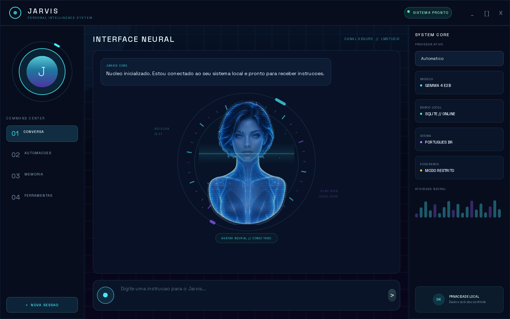

# Jarvis Pessoal

Assistente pessoal de inteligência artificial para desktop, desenvolvido em Python com PySide6/QML. O projeto adota uma abordagem **local-first**: memória, configurações e histórico ficam no computador do usuário, com integração opcional a provedores de IA locais ou em nuvem.



## Recursos

- Interface desktop com temas claro e escuro, chat e painel de telemetria.
- Integração com Ollama, LM Studio, OpenAI, Anthropic e Gemini.
- Voz em português: transcrição local com faster-whisper e síntese por SAPI5, Kokoro ou Gemini.
- Memória local em SQLite, agenda, rotinas e sugestões proativas.
- Agente com ferramentas de arquivos, shell, navegador, SSH, mídia e análise de documentos.
- Perfis de uso normal, cibersegurança e desenvolvimento.
- Módulos para pacientes, documentos, exames e conhecimento clínico local.
- Ponte opcional para WhatsApp baseada em Node.js e Baileys.


## Requisitos

- Windows 10 ou 11
- Python 3.11 ou superior
- Node.js 18 ou superior, somente para a integração com WhatsApp
- Ollama ou LM Studio para modelos locais, ou uma chave de API para um provedor em nuvem
- Cliente OpenSSH do Windows para as funções SSH

## Instalação

No PowerShell:

```powershell
git clone https://github.com/euricotecnologia/jarvis.git
cd jarvis
python -m venv .venv
.\.venv\Scripts\Activate.ps1
python -m pip install --upgrade pip
pip install -e ".[full]"
Copy-Item config.example.toml config.toml
jarvis init-db
jarvis gui
```

Para uma instalação menor, use apenas os grupos necessários:

```powershell
pip install -e ".[gui,voice,agent]"
```

Os modelos locais de voz e transcrição são baixados ou configurados pelo próprio usuário e não fazem parte deste repositório.

## Configuração dos provedores

Edite `config.toml` para escolher o provedor e o modelo. As chaves devem ser fornecidas por variáveis de ambiente, nunca gravadas no repositório:

```powershell
$env:OPENAI_API_KEY = "sua-chave"
$env:ANTHROPIC_API_KEY = "sua-chave"
$env:GEMINI_API_KEY = "sua-chave"
```

O arquivo `config.example.toml` documenta as opções disponíveis. Por padrão, permissões sensíveis como escrita em arquivos, shell, navegador e SSH permanecem desativadas.

## Integração com WhatsApp

```powershell
cd services\whatsapp_bridge
npm install
npm start
```

Na primeira conexão, escaneie o QR Code exibido pelo Jarvis. A sessão é armazenada somente em `data/whatsapp_session/` e está ignorada pelo Git.

## Comandos úteis

```powershell
jarvis providers  # lista os provedores configurados
jarvis doctor     # testa as conexões
jarvis chat       # conversa no terminal
jarvis gui        # abre a interface gráfica
```

## Testes

```powershell
python -m unittest discover -s tests
```

## Privacidade e segurança

Este repositório publica somente código-fonte e recursos necessários. Não são incluídos banco local, sessões do WhatsApp, arquivos de configuração pessoais, chaves de API, modelos de IA, ambientes virtuais, dependências instaladas, caches ou binários compilados.

As ferramentas capazes de alterar arquivos, executar comandos ou acessar hosts remotos exigem configuração explícita. Revise as permissões antes de habilitá-las.

## Aviso sobre os recursos de saúde

Os módulos clínicos são ferramentas de apoio e organização. Eles não substituem diagnóstico, prescrição, julgamento profissional nem protocolos da instituição. Todo conteúdo gerado deve ser revisado por um profissional habilitado.

## Licença

Distribuído sob a licença MIT. Consulte [LICENSE](LICENSE).
